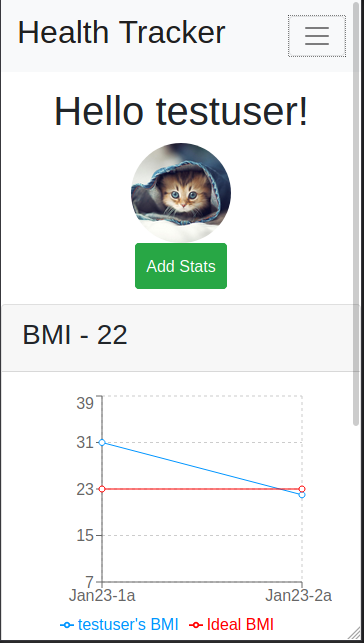
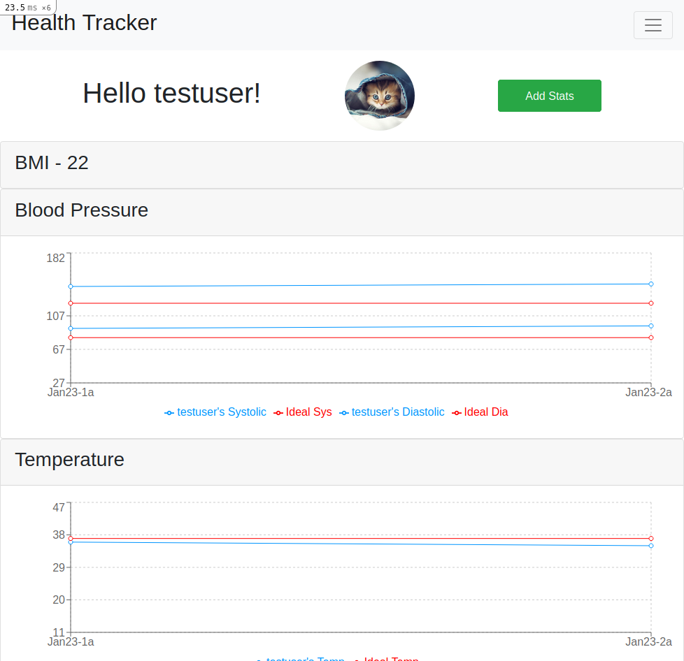

> This project is a React and Rails based app built as the Final capstone project for the Microverse coursework. It is meant to track health data, allow users to schedule doctor appointments, and connect to others in community groups.

# Health Tracker

## Project Description

The project is a tracker app designed to display tracked results fetched from a back-end API. It fetches user data such as health information and appointment times. Additionally it allows a user to schedule appointments and reach out for community support

#### Features
-   Responsive layout works well on mobile or desktop
-   Secure data: all data shared through our API is anonymous and contains no personally identifying information
-   Secure Login: JWT authentication is required
-   Track health data such as BMI, Blood pressure, Temperature, Pulse, and Blood Sugar
-   Inputted data can be corrected within the same clock hour
-   Monitor data over time with line graphs of data points as compared to the ideal point for each graph
-   Request appointments with a doctor of your choice
-   Join support group communities
-   Find health related resources
-   Edit settings

###### Coming Features
-   Personal profile pictures
-   Add friendships to stay connected
-   Friend to Friend and Community chat
-   Sick call feature for triage evaluation
-   Enhanced API data filtering
-   Personalized color coding for chart lines
-   Dark mode for app
-   Login for Doctors

## Built With
-   Atom
-   Ubuntu
-   Node.js / yarn
-   React / React-DOM / Redux / React-Router
-   Ruby / Ruby on Rails
-   JavaScript ES6 / HTML / SCSS
-   Bootstrap

### To Use The App
REGISTRATION AND FIRST USE:  
-   Unregistered users are able to view the available resources, communities, and doctors associated with this app
-   To begin using this app, go to registration and fill out the entire form
-   After submitting your registration you will be directed to your home page where you will find a list of charts and an 'Add Stats' button
-   To enter your first data points, click on 'Add Stats' and fill out the displayed form (weight is not necessary as your first weight data point was input upon registration)
-   After submitting your stats, you can view how they compare to the Ideal data points
-   CAUTION! if you registered using the Metric scale, all your future measurements should be input in the same scale
-   Additionally you may click on the Community tab in the header and choose either Doctor, Friends, or My Account 

SIGN IN:
-   If you are already registered, click on 'Sign In'. Unless you are a Doctor registered with our app leave the 'I am a Doctor' option unchecked.

YOUR USERNAME:
-   Clicking this will take you to your homepage where you can 'Add Stats' or view your charts 
-   Future updates may include a personal profile picture in this position 

SICK CALL: 
-   This feature will allow a user to answer a series of questions to determine any probable medical need based on official triage criteria
-   It will be added in a future update

RESOURCES: 
-   Clicking this will take you to a resource page
-   These resources will be updated as better ones become available
 
DOCTORS: 
-   This is where you will find available doctors.
-   Clicking on 'Schedule a Consultation' will take you to a consultation form. Fill in the time requested and a reason for this consultation and the chosen doctor will approve or reschedule as their availability allows
-   Requested appointments information will appear in the 'My Appointments' tab, while the list of doctors you are scheduled with will appear in the 'My Doctors' tab

FRIENDS: 
-   This is where you will find available communities.
-   After clicking one you are presented with a list of current members and the option to 'Join Community'
-   Future updates will allow you to add members as friends so you may chat with them. You will find them listed in the 'My Friends' tab when this feature is live 
-   After joining a community, you will be able to find it in the list of 'My Communities' 
 
MY ACCOUNT:
-   This will take you to account settings where you can update your username, email, or password 
-   Emails must be unique

### To Use The API 
To Gather Data:  
Replace any words that begin as `:` with your search criteria. For example, to get all users between 28 and 32, use  
`GET /age/30/2` 
  
`- GET / ` Retrieve all Users.  

`- GET /age/:age/:range ` Retrieve all Users That Match Search Parameters.  

`- GET /sex/:sex' `  Retrieve all Users That Match Search Parameters.  
Sex options are `XX` or `XY`  

`- GET /ethnicity/:ethnicity ` Retrieve all Users That Match Search Parameters.  
Ethnicity options are as follows:  
-   `European` 
-   `Central & South Asian`
-   `East Asian & Native American` 
-   `Sub-Saharan African` 
-   `Western Asian & North African` 
-   `Melanesian`  

`- GET /height/:scale/:height ` Retrieve all Users That Match Search Parameters.  
Scale options are `Metric` or `Imperial`  
Note: Measurements in Metric must be given in Centimeters, Imperial in Inches

`- GET doctors `  Retrieve all Registered Doctors  

`- GET communities `  Retrieve all Available Communities 

Searches by preferred gender, ranges for height, weight, and age, as well as high blood pressure and high blood sugar will become available with a future update

To Use API for your project:  
I strongly recommend looking at the code base in order to properly structure your body parameter data. 

`- POST /user` 	Register a New User  
body: { user: { name, email, password, dob, age, sex, gender, ethnicity, height, weight }}  
**returns user data and token

`- POST /user/login` 	User Login  
body: { user: { email, password }}  
**returns user data and token

`- POST /user/doctor` Doctor Login  
*Route currently unavailable

`- PATCH /user/:id` Add Stats to User  
body: { user: { temperature, weight, pulse, blood_sugar, systolic, diastolic }}  
**requires token

`- PATCH /user/settings` Change User Account Settings  
body: { user: { id, name, email, password }}  
**requires token

`- POST /user/add_appointment` Schedule an Appointment  
body: { user: { id }, appt: { doc_name, date, time, notes }}  
**requires token

`- GET /user_appointments` Retrieve all User Appointments  
**requires token

`- POST /user/cancel_appointment` Cancel an Appointment  
body: { user: { id }, appt: { id }}  
**requires token

## Live Demo
#### Deployed on: HEROKU
Try it out [here](https://defoebrand-health-tracker.herokuapp.com)

## Getting Started Locally
### Prerequisities
To get this project up and running locally, you must be able to the necessary packages to run React and Ruby on Rails already installed on your computer.

**To get this project set up on your local machine, follow these simple steps:**

**Step 1** 
Navigate to the local folder where you want the repository to be cloned and run
`git clone https://github.com/defoebrand/Health-Tracker.git`. 

**Step 2** 
Next, run `cd Health-Tracker`. 

**Step 3** 
Run `rails s` to begin the server. 

**Step 4** 
Navigate to `http://localhost:3000/` in a browser of your choice to see the application running 

### Testing
##### Back-End
This project uses Minitest for testing Rails features.
> To run tests open a terminal inside the project's root directory and enter `rails test`

##### Front-End
This project uses React Testing Library and Jest-Dom for testing React features.
> To run tests open a terminal inside the project's root directory and enter `yarn test`

## Authors

👤 **Brandon Defoe**

-   Portfolio: [defoebrand](https://www.defoebrand.com)
-   Github: [@defoebrand](https://github.com/defoebrand)
-   LinkedIn: [@defoebrand](https://www.linkedin.com/in/defoebrand/)
-   Gmail: <mailto:defoe.brand@gmail.com>

## 🤝 Contributing

Our favorite contributions are those that help us improve the project, so please leave an issue or a feature request if you have any suggestions!

Feel free to check the [issues page](https://github.com/defoebrand/Health-Tracker/issues) to either create an issue or help us out by fixing an existing one.

Also feel free to leave an issue if you have resources you would like to see added!

## Show your support

If you've read this far....give us a ⭐️!

## :clap: Acknowledgements

-   Microverse
-   [Gregoire Vella on Behance](https://www.behance.net/gregoirevella)

"Video conference Doctor": Photo by Edward Jenner from Pexels  
"CLasped Hands": Photo by fauxels from Pexels  
"Stethoscope": Photo by Negative Space  
"Dr. Smith": Image by <a href="https://pixabay.com/users/tatyanabuzmakova_krasnova-12151052/?utm_source=link-attribution&amp;utm_medium=referral&amp;utm_campaign=image&amp;utm_content=5871743">Татьяна Краснова</a> from <a href="https://pixabay.com/?utm_source=link-attribution&amp;utm_medium=referral&amp;utm_campaign=image&amp;utm_content=5871743">Pixabay</a>  
"Dr. Kim": Image by <a href="https://pixabay.com/users/anhngoc1397-14450218/?utm_source=link-attribution&amp;utm_medium=referral&amp;utm_campaign=image&amp;utm_content=4677401">Anh Nguyễn Duy</a> from <a href="https://pixabay.com/?utm_source=link-attribution&amp;utm_medium=referral&amp;utm_campaign=image&amp;utm_content=4677401">Pixabay</a>
"Standard Profile": Image by <a href="https://pixabay.com/users/wanderercreative-855399/?utm_source=link-attribution&amp;utm_medium=referral&amp;utm_campaign=image&amp;utm_content=973460">Stephanie Edwards</a> from <a href="https://pixabay.com/?utm_source=link-attribution&amp;utm_medium=referral&amp;utm_campaign=image&amp;utm_content=973460">Pixabay</a>

## 📝 License

This project is licensed by Microverse
